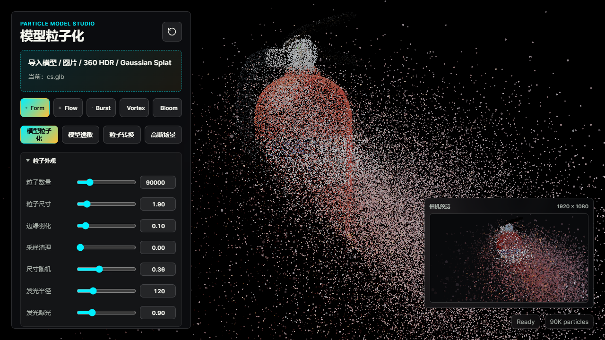
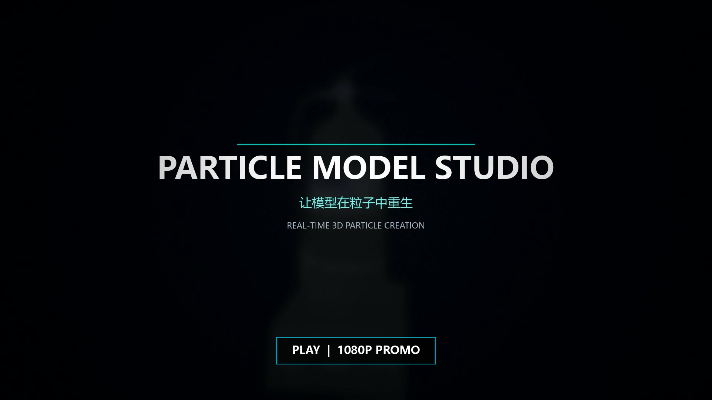
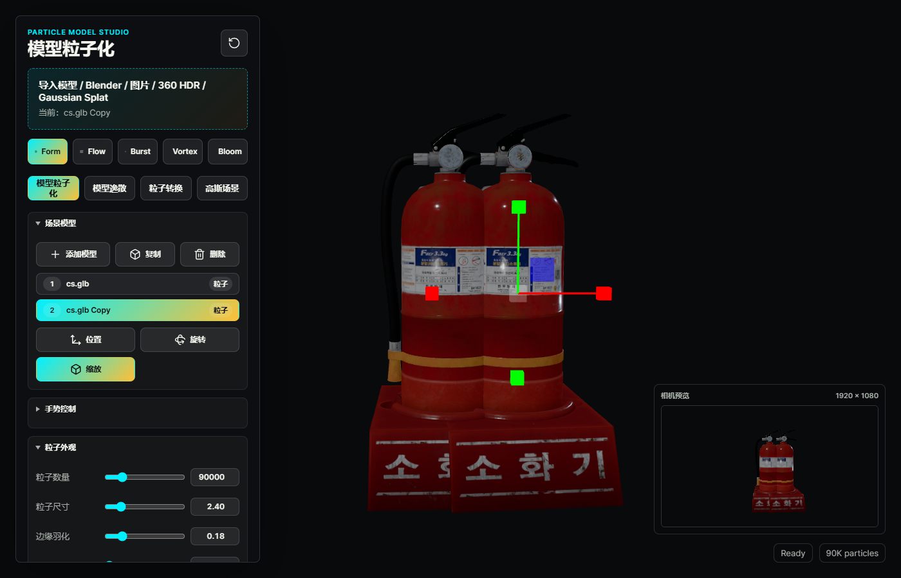
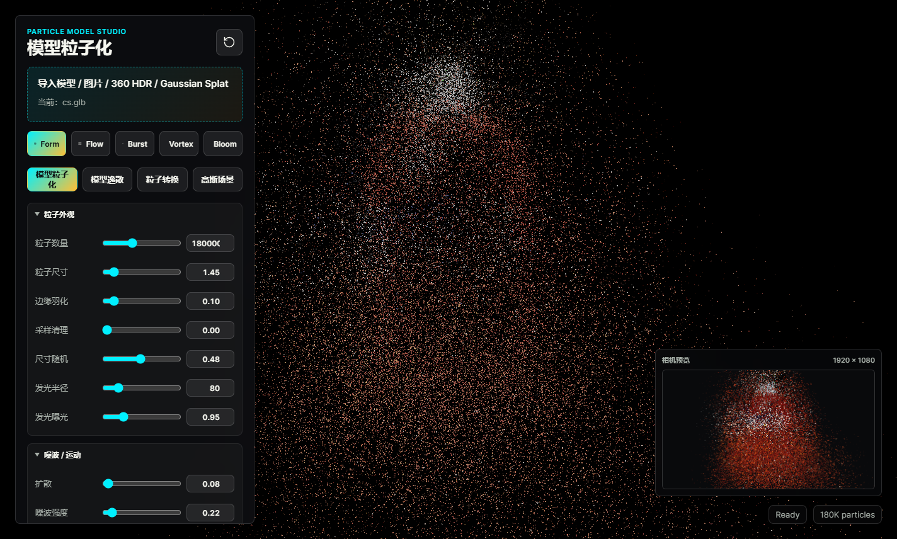
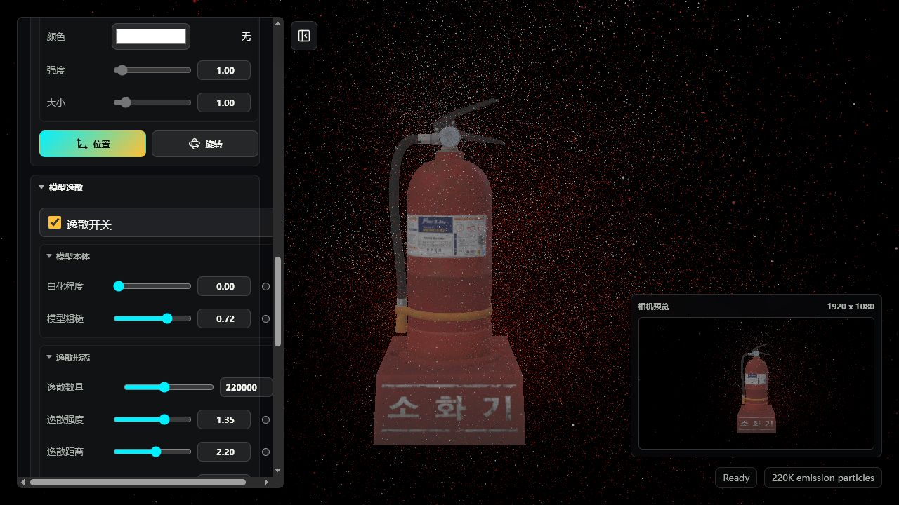
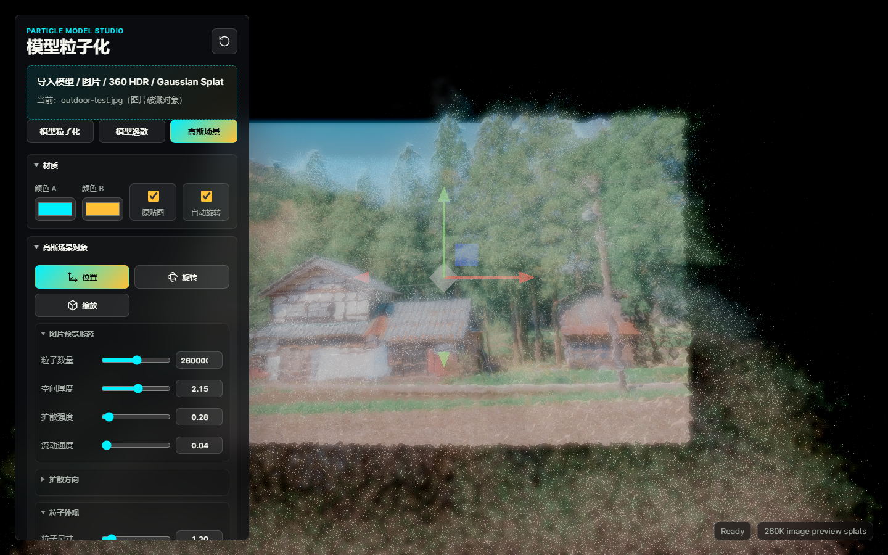
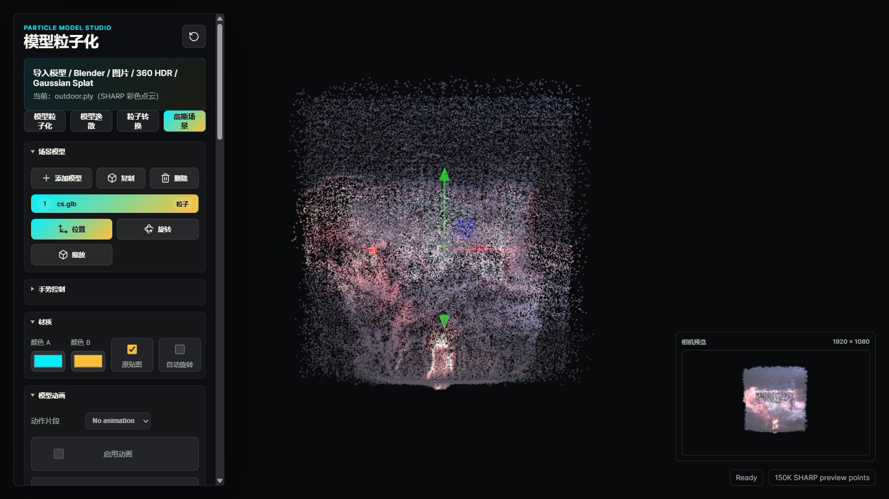
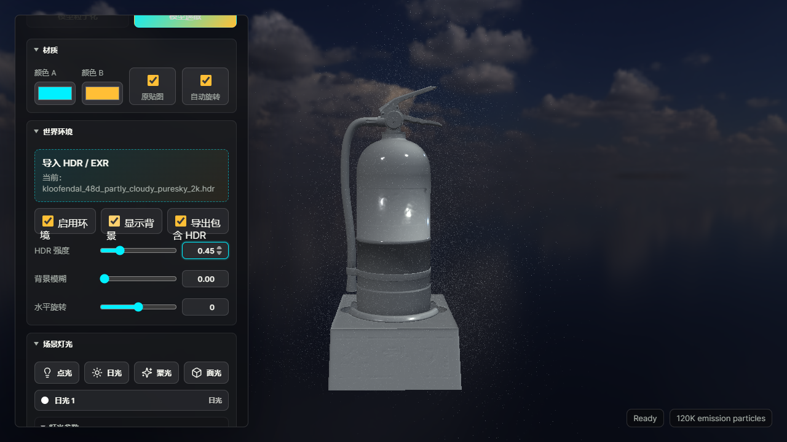
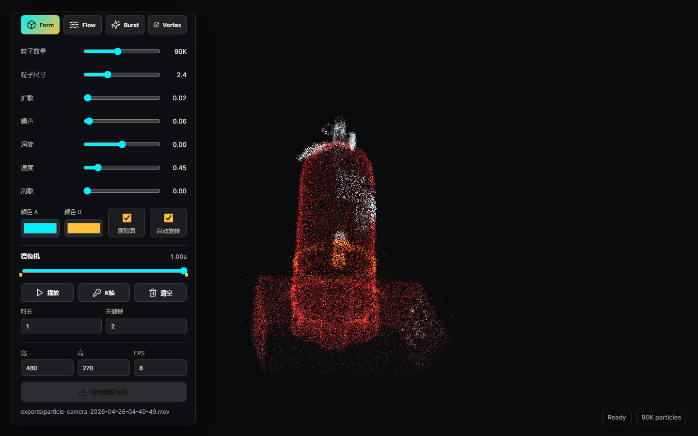

# Particle Model Studio / 模型粒子化

[](https://github.com/ying1459/particle-model-studio/releases/latest)
[](LICENSE)
[](https://github.com/ying1459/particle-model-studio/releases/latest)
[](https://threejs.org/)

一个面向视觉创作者的实时 3D 粒子工作室：把模型或图片变成粒子、制作完整消散与模型变形动画、布置 HDR 和灯光、编辑相机关键帧，最后导出透明 MOV、H.264 MP4 或 360° 全景 MP4。

Particle Model Studio is a real-time 3D particle editor for visual creators. Import models or images, design particle dissolves and morphs, preview Gaussian Splats, animate parameters and cameras, and export transparent MOV, H.264 MP4, or 360° equirectangular MP4 video.



## 宣传视频 / Promo Video

[](https://github.com/ying1459/particle-model-studio/releases/download/v1.0.0/Particle-Model-Studio-Promo-1080p.mp4)

点击上图观看 1080p 宣传片：模型逸散、完整消散、双模型 Morph、图片转 3D 点云，以及 HDR 灯光与相机制作都收录其中。

> 想直接体验？前往 [Latest Release](https://github.com/ying1459/particle-model-studio/releases/latest) 下载 Windows x64 版本。项目对你有帮助的话，欢迎点一个 ⭐ Star。

## 它能做什么

| 工作流 | 能力 |
| --- | --- |
| 模型输入 | GLB、GLTF、FBX、OBJ、STL，以及桌面版 `.blend` 转换 |
| 粒子效果 | Form、Flow、Burst、Vortex、Bloom、Whale 预设；模型粒子化、逸散、生长和消散 |
| 形态转换 | 在两个模型之间进行粒子 Morph，可调流向、散开、湍流和拖尾 |
| 图片空间化 | 普通图片一键生成带景深的彩色点云；可选 SHARP 高质量重建 |
| Gaussian Splat | 加载 PLY、SPLAT、KSPLAT、SPZ，并进行位置、旋转和缩放编辑 |
| 场景制作 | 多模型、材质、HDR / EXR 环境、点光、日光、聚光和面光 |
| 动画控制 | 模型动作片段、参数独立关键帧、相机路径、速度曲线、最终画幅预览 |
| 工程文件 | `.pms` 自包含工程保存/打开，恢复模型、参数、灯光、相机、K 帧和导出设置 |
| 交互与输出 | `Ctrl+Z` 撤销；MediaPipe 摄像头手势控制；透明 MOV、H.264 MP4 与带球面元数据的 360° MP4 |

## 功能详解

### 1. 导入模型与多模型场景

将文件拖入窗口即可开始。常用的 GLB / GLTF / FBX / OBJ / STL 会直接加载；Windows 桌面版还可以调用本机 Blender，把 `.blend` 临时转换为 GLB 后导入。若电脑没有安装 Blender，先在 Blender 中导出 GLB 或 FBX 即可。

场景不局限于一个对象：可以继续添加、复制、选择或删除模型，并使用可视化坐标轴分别调整位置、旋转和缩放。每个对象可独立保留实体或粒子状态，适合组合产品、建筑和角色场景。

桌面版可使用顶部的“保存工程”和“打开工程”管理 `.pms` 文件。保存时会把模型、图片、HDR、Morph 目标等外部资源嵌入工程，同时记录粒子参数、灯光、相机、时间轴、全部 K 帧和导出设置。快捷键为 `Ctrl+S` 保存、`Ctrl+Shift+S` 另存为、`Ctrl+O` 打开。



### 2. 粒子外观与动态预设

粒子会从模型表面采样，并尽量继承原模型贴图颜色。基础参数包括粒子数量、尺寸、边缘羽化、采样清理、随机尺寸、发光半径和曝光；运动层可以继续控制扩散、噪波、涡旋和速度。

六个预设是可继续编辑的起点：

- **Form**：保持模型轮廓，适合产品展示和静态点云造型。
- **Flow**：加入柔和流动，让表面粒子持续呼吸和漂移。
- **Burst**：向外扩散爆发，适合冲击、转场和节奏点。
- **Vortex**：使用涡旋场卷动粒子，适合能量和传送效果。
- **Bloom**：从流丝和花瓣状轨迹中生长，再逐步消散。
- **Whale**：偏水雾、流体感的有机消散风格。



### 3. 模型粒子化与完整消散

“模型粒子化”用于在实体模型与表面粒子之间过渡。你可以分别控制粒子化进度和模型显隐，因此既能做完整替换，也能让实体与粒子叠加存在。

消散部分提供消散进度、扩散距离、边缘宽度、湍流和流丝卷曲。进度到达终点时模型和残余粒子会完全退出画面，适合做干净的片尾、转场或循环动画。

### 4. 模型逸散与局部破碎

“模型逸散”模拟实体表面持续剥离成粒子的过程。它与普通粒子化不同：原模型仍可保持可见，同时在表面生成流动碎屑。

可以调节白化程度、模型粗糙度、逸散数量、强度、距离、速度、风向、湍流、粒子尺寸、透明度和发光。局部破碎还提供破碎中心、范围、羽化和碎片大小，用来指定从模型哪个区域开始瓦解。

默认展示参数使用原始贴图（白化程度 `0`），并提高到 `220,000` 个逸散粒子、`1.35` 强度和 `2.20` 距离，让模型表面剥离与飞散轨迹在默认画面中就清楚可见。



### 5. 双模型粒子转换（Morph）

导入目标模型 2 后，粒子可从当前模型逐步重组为目标模型。转换不是简单淡入淡出：可设置转换进度、流动感、空间散开、湍流、拖尾宽度，以及 X / Y / Z 的整体流向。

它适合产品 A/B 转换、Logo 变形、角色切换和粒子传送。两个模型形状差异较大时，提高空间散开和拖尾宽度通常能得到更自然的中间状态。

### 6. 图片转彩色空间点云

导入 JPG、PNG 或 WebP 后，内置模式会根据图像颜色与估算深度生成空间点云，不依赖 SHARP，也不需要联网。它已经针对普通横图、竖图和透明图片做了独立处理。

可调参数包括粒子数量、空间厚度、扩散方向、湍流、点直径、边缘羽化、图片色彩、透明度和发光；也可以保留一张可调透明度的原图薄片，增强正面观看时的细节。



### 7. SHARP 高质量重建与 Gaussian Splat

Full SHARP 版内置 Apple ml-sharp 所需的 Python 环境和模型权重，可以在本机把单张图片重建为真实的 Gaussian Splat / 彩色 PLY。软件内提供“检测环境”“安装/修复环境”和“一键生成”入口；生成可能需要数分钟，具体取决于硬件和图片尺寸。

已有的 `.ply`、`.splat`、`.ksplat`、`.spz` 文件也可以直接加载，并使用场景变换工具调整位置、旋转与缩放。Lite 版仍然完整支持上一节的内置图片点云，只是不附带 SHARP 运行时和模型权重。



> **许可提醒：** Full 包内的 Apple Machine Learning Research Model 仅限非商业科研与学术开发用途。它不适用于商业利用、产品开发或商业产品/服务，详情见 [THIRD_PARTY_NOTICES.md](THIRD_PARTY_NOTICES.md)。

### 8. HDR 环境、灯光与材质

可以导入 `.hdr` 或 `.exr` 作为 360° 世界环境，分别控制环境开关、背景显示、导出时是否包含背景、HDR 强度、背景模糊和水平旋转。

场景灯光支持点光、日光、聚光和面光。每盏灯可独立设置颜色、强度、尺寸、位置和旋转；配合模型材质与粒子发光，可以同时兼顾实体质感和粒子氛围。



### 9. 模型动画与参数关键帧

带动画的 GLB / GLTF / FBX 可选择动作片段，设置启用、自动播放、动画进度和播放速度。粒子从动画模型采样时会跟随当前姿态，便于制作运动角色或机械结构的粒子效果。

主要效果参数旁可以直接添加或更新关键帧。粒子数量、尺寸、扩散、生长、消散、Morph、逸散、模型动画进度和摄像机镜头参数都能分别 K 帧；相机路径不会再隐式改写这些参数。

### 10. 相机路径与最终画幅预览

在时间轴上移动相机后点击“相机 K 帧”，即可只记录位置和朝向。关键帧支持移动、旋转、显示大小、时间调整和速度曲线；“相机大小”用于放大场景中的相机线框与操控手柄，焦段用于控制最终透视取景。景深开启后可调整光圈和焦点距离。“相机视图”会按最终导出宽高显示画面，减少编辑视角和成片构图不一致的问题。

摄像机类型可切换为“360° 全景摄像机”。该模式使用 2:1 等距柱状画幅渲染完整环视帧，导出为 H.264 MP4，并自动写入播放器所需的球面视频元数据；全景模式会自动关闭只适用于透视镜头的景深。

右下角的相机预览会持续显示最终镜头，方便一边调整粒子，一边观察导出结果。



### 11. 摄像头手势控制

启用后，MediaPipe Hand Landmarker 会在本机识别手掌开合、移动幅度和速度，并把它们映射到粒子流动、生长、Morph 或消散参数。可调控制强度、平滑程度、识别帧率和镜像预览，也能把当前手势设为新的控制基准。

该功能适合现场演示、互动装置原型和录屏表演；摄像头画面用于本地识别，不需要上传到云端。

### 12. MOV、MP4 与 360° MP4 导出

设置格式、宽、高、FPS 和时长后，可直接按相机时间轴渲染视频。透明 MOV 优先编码为带 Alpha 通道的 ProRes 4444（`yuva444p10le`），失败时回退到 qtrle；普通 MP4 与 360° MP4 使用兼容性较好的 H.264 `yuv420p`。360° MP4 会强制采用 2:1 画幅并写入 mono equirectangular 球面元数据。导出前会预热并重新锁定模型变换，避免首次渲染出现瞬时跳位。

相机预览、主相机视图和最终导出共用相同的灯光、色彩映射与 Bloom 分辨率比例。默认场景不会再使用随相机距离加深的指数雾；远景粒子保留至少一个像素的能量下限，避免拉远镜头后画面无故变暗。

透明视频可以直接叠加到 Premiere Pro、After Effects、DaVinci Resolve 等后期软件中。若启用“导出包含 HDR”，世界背景也会进入成片；关闭后则保留透明背景。

## 下载与版本选择

前往 [Releases](https://github.com/ying1459/particle-model-studio/releases/latest)：

| 版本 | 包含内容 | 推荐对象 |
| --- | --- | --- |
| **Lite** | 完整编辑器、模型粒子、图片点云、Gaussian Splat 查看、动画与 MOV/MP4/360° MP4 导出 | 大多数用户；体积更小，解压即用 |
| **Full SHARP** | Lite 的全部功能，加 Python 运行时、ml-sharp 和模型权重 | 需要本地单图高质量重建，且接受 SHARP 模型许可的研究用户 |

Full SHARP 因体积较大以 RAR 分卷发布。请把所有分卷下载到同一文件夹，从 `part1.rar` 开始解压。

## 快速开始

1. 下载 Lite 或 Full SHARP，并完整解压。
2. 运行 `Particle Model Studio.exe`；不要只把 exe 单独复制出来。
3. 把模型、图片、HDR 或 Gaussian Splat 拖入左上角导入区。
4. 选择“模型粒子化”“模型逸散”“粒子转换”或“高斯场景”。
5. 调整效果参数，需要动画时为参数和相机添加关键帧。
6. 使用 `Ctrl+S` 保存 `.pms` 工程；选择 MOV、MP4 或 360° MP4，设定画面尺寸、FPS 与时长后导出。

## 常见问题

**为什么 `.blend` 无法导入？**

`.blend` 转换需要 Windows 桌面版和本机 Blender。也可以手动从 Blender 导出 GLB / FBX 再导入。

**Lite 能把图片变成粒子吗？**

可以。内置图片点云完全可用；只有“单图生成真实 Gaussian Splat”的 SHARP 重建不包含在 Lite 中。

**为什么 Full 要下载多个文件？**

Python 运行时和 SHARP 权重较大，因此发布为分卷压缩包。缺少任一分卷都会导致解压失败。

**软件必须联网吗？**

编辑、点云生成、SHARP 重建和导出均可在本地运行。首次自行安装/修复 SHARP 环境时可能需要下载依赖和模型。

**可以商用吗？**

项目自有源代码采用 MIT License，但所有第三方组件仍遵循各自许可。特别是 Full 包内的 Apple SHARP 模型不能用于商业产品或服务；请在发布作品前阅读 [THIRD_PARTY_NOTICES.md](THIRD_PARTY_NOTICES.md)。

## 本地开发

```bash
npm install
npm run dev
```

构建 Windows 桌面应用：

```bash
npm run dist:win
```

运行自动化冒烟测试：

```bash
npm run test:smoke
```

可选 SHARP 环境可通过 `electron/setup-ml-sharp.ps1` 安装。大型 Python 运行时、模型权重和发布压缩包不会提交到 Git 仓库。

## 技术栈

- Three.js + GLSL：实时 3D、模型采样和粒子着色器
- Vite：开发与前端构建
- Electron：Windows 桌面应用、Blender / SHARP / FFmpeg 本地桥接
- MediaPipe Tasks Vision：本地手部识别
- GaussianSplats3D：Gaussian Splat 加载与预览
- FFmpeg：透明 MOV 编码

## 许可与支持

项目自有源代码采用 [MIT License](LICENSE)。第三方组件遵循各自许可，详见 [THIRD_PARTY_NOTICES.md](THIRD_PARTY_NOTICES.md)。

发现问题或有功能建议，请提交到 [Issues](https://github.com/ying1459/particle-model-studio/issues)。如果你喜欢这个项目，欢迎点一个 ⭐，也欢迎分享你的粒子作品。
