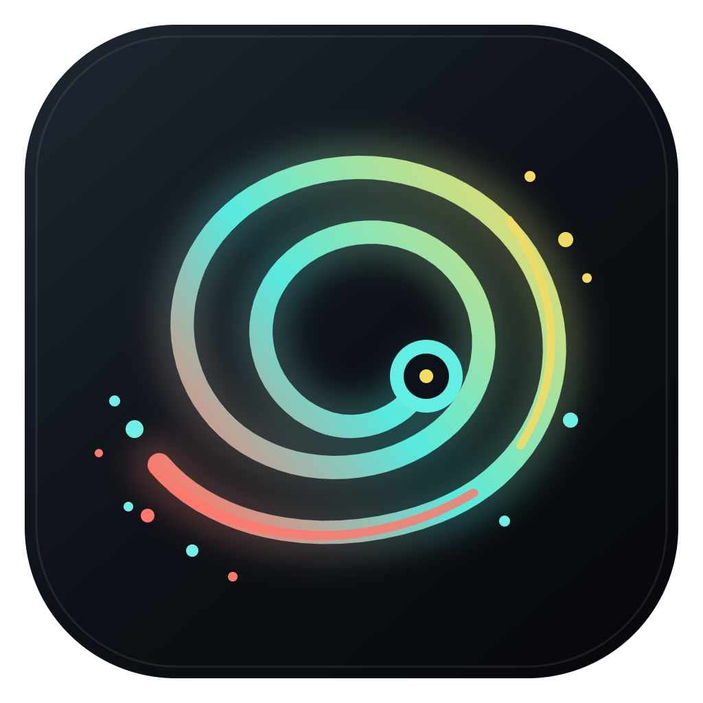
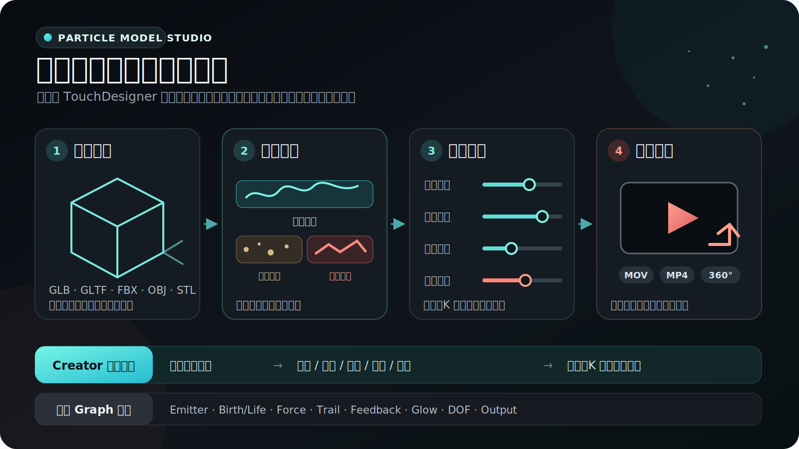
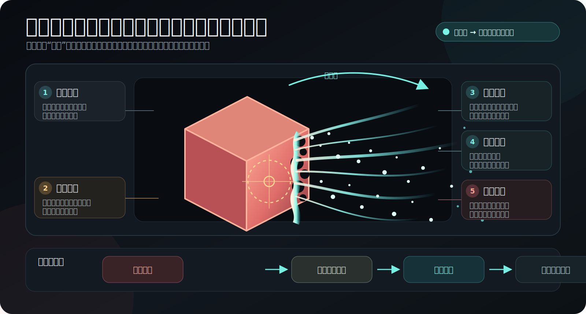
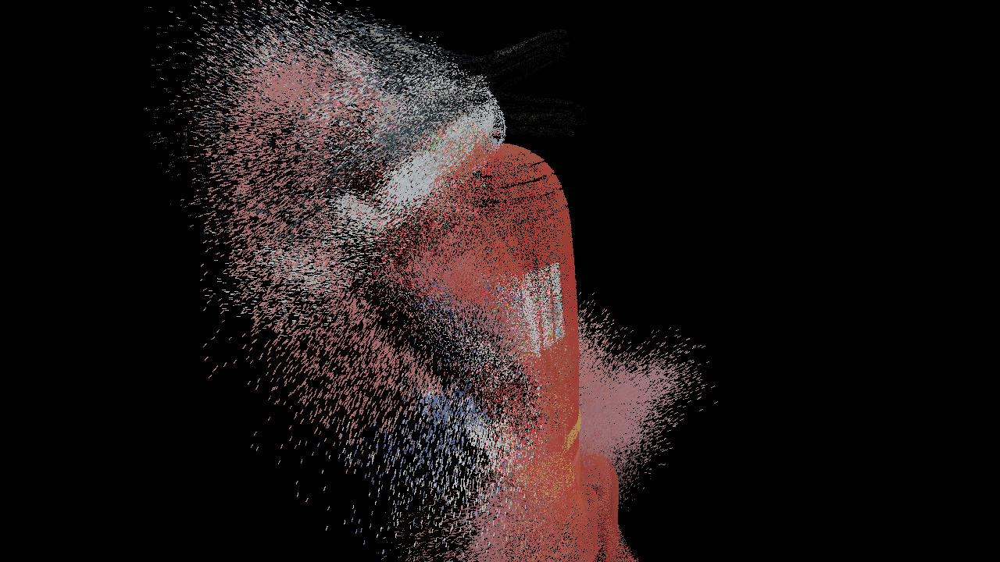
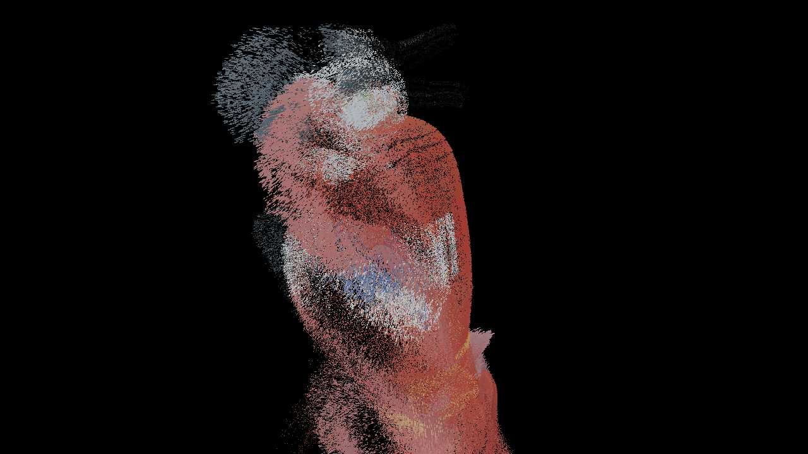
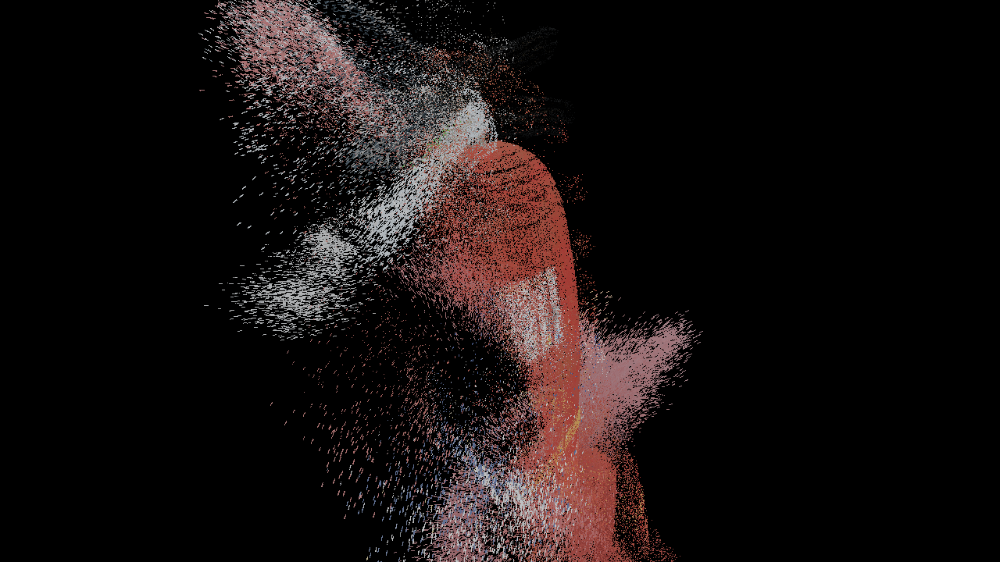
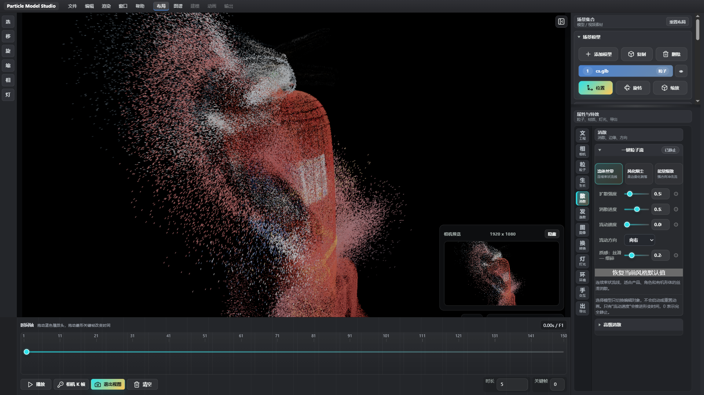
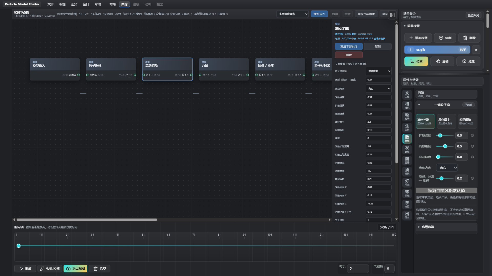

# Particle Model Studio / 粒子模型工作室

<p align="center">
  
</p>

[](https://github.com/ying1459/particle-model-studio/releases/latest)
[](LICENSE)
[](https://github.com/ying1459/particle-model-studio/releases/latest)
[](https://threejs.org/)

## 它是什么

**Particle Model Studio 是一款面向视觉创作者的实时 3D 粒子软件。** 它不要求你先学会 TouchDesigner 的节点体系：导入模型、选择风格、调整几个直观参数，就能得到消散、逸散、流丝、烟尘、辉光、景深和镜头动画；需要更深控制时，再进入全中文 Graph。

> 我们要替代的是复杂的制作流程，不是照搬 TD 的操作方式。Creator 负责快速出片，Graph 负责无限扩展。



## 一眼看懂软件

| 你要做什么 | 在软件里怎么做 | 得到什么 |
| --- | --- | --- |
| 快速做模型粒子效果 | 导入模型 → 选择三套风格之一 → 调整五个主要参数 | 可直接预览和导出的 TD 风格粒子镜头 |
| 做模型逸散与局部破碎 | 点击右侧“逸散”，调整数量、距离、风向、湍流和破碎范围 | 模型本体与逸散颗粒连续衔接 |
| 做镜头与后期 | 设置相机、光圈景深、Deep Glow 风格辉光和关键帧 | 视口、相机预览、静帧与视频保持一致 |
| 搭复杂粒子系统 | 进入中文 Graph，组合发射、生命周期、力场、吸引、碰撞与反馈 | 可复用、可旁路、可诊断的高级效果链 |

## 粒子逸散图解



模型逸散由五部分共同构成：模型本体决定保留的实体质感，局部破碎限定作用区域，逸散数量与距离控制尾迹规模，风向和湍流塑造运动路径，粒子尺寸、透明度与辉光控制最终材质。点击右侧“逸散”属性页会自动切换到该渲染模式。

## 实机效果


[▶ 观看 1.0.21 宣传片](https://github.com/ying1459/particle-model-studio/releases/download/v1.0.21/Particle-Model-Studio-1.0.21-Promo-1080p.mp4) · [⬇ 下载最新版](https://github.com/ying1459/particle-model-studio/releases/latest) · [🗺 开发路线](docs/TOUCHDESIGNER_PARITY_ROADMAP.md)

> 当前版本：**1.0.22** · Windows x64 · 本地运行 · 工程文件可自包含保存

### 1.0.22 逸散入口修复

右侧点击“逸散”会直接进入模型逸散模式，切回粒子、消散或生长页会返回模型粒子模式。工程中的逸散参数与关键帧保持不变，不再需要到“工程”页二次切换模式。

## Creator 与 Graph

| 模式 | 适合谁 | 使用方式 |
| --- | --- | --- |
| **Creator 创作模式** | 想快速出片的视觉创作者 | 三种一键风格 + 扩散、消散、速度、方向、质感等核心参数；高级塑形默认折叠 |
| **Graph 图谱模式** | 需要自定义模拟与后期链的用户 | 中文节点与端口；可组合 Emitter、Birth/Life、Force、Attractor、Collision、Trail、GPU Feedback、Glow、DOF 与输出 |

Creator 模式默认使用确定性解析流场，不会偷偷启动 GPU Feedback。每个模型拥有独立时间：**速度为 0 就完全静止，选择或切换模型不会启动、停止或重置动画。** 自定义 Graph 中仍可显式启用 GPU Feedback。

## 1.0.21：三种一键粒子流

| 流体丝带 | 风化烟尘 | 能量爆散 |
| --- | --- | --- |
| 连续束状流线，适合产品、角色与有机形体 | 短拖丝与柔边雾化，适合风化和缓慢剥落 | 强方向、高卷曲与窄亮边，适合冲击和传送 |
|  |  |  |

新版消散不再是“单层噪声阈值 + 随机喷点”。它使用模型局部包围盒、多尺度流场和连续侵蚀前沿，把粒子稳定组织成主体、丝带、边缘碎片与雾化颗粒；Low / Medium / High 分别使用 1 / 2 / 3 层流场细节。

## 当前界面



- 三张风格卡直接可见，不需要打开下拉菜单寻找效果。
- “已静止 / 流动中”实时显示粒子时间状态。
- 右侧只保留常用参数，高级消散与塑形折叠收纳。
- 相机预览、主视口和导出使用一致的渲染链。

## 中文节点图谱



- 节点、端口、类型和主要参数均有中文名称。
- 鼠标中键平移画布；左键选择并拖拽节点，交互接近 Blender。
- 支持添加、复制、删除、旁路、撤销/重做、预演下游执行和资源诊断。
- Creator 图保持简单稳定；自定义 Graph 才启用跨帧 GPU Feedback 与复杂模拟。

## 核心能力

| 工作流 | 能力 |
| --- | --- |
| 模型输入 | GLB、GLTF、FBX、OBJ、STL；桌面版可调用本机 Blender 转换 `.blend` |
| 粒子化 | 模型表面采样、贴图颜色继承、实体与粒子过渡、近景微粒密度补偿 |
| 消散与扩散 | 三种解析流场、连续侵蚀边缘、束状拖丝、方向预设、质感控制 |
| 图谱模拟 | Emitter、Birth/Life、Force、Return/Repel、Attractor、Plane Collision、Trail、GPU Feedback |
| 辉光 | 多层深度辉光，独立控制半径与曝光，低数值保持连续过渡 |
| 景深 | 有符号薄透镜 CoC、圆润多边形光圈、散景半径、高光、叶片与圆润度 |
| 场景 | 多模型集合、材质、HDR/EXR、点光、日光、聚光、面光、多摄像机 |
| 图片与 Splat | 图片转彩色空间点云；加载 PLY、SPLAT、KSPLAT、SPZ |
| 动画 | 参数独立关键帧、模型动作、相机路径、速度曲线、确定性时间轴 |
| 工程 | `.pms` 保存模型、资源、参数、灯光、相机、图谱、K 帧和导出设置 |
| 输出 | 透明 ProRes 4444 MOV、H.264 MP4、360° 等距柱状 MP4 |
| 互动 | MediaPipe 本地手势识别，可映射到流动、生长、Morph 或消散 |

## 快速开始

1. 从 [Releases](https://github.com/ying1459/particle-model-studio/releases/latest) 下载 Lite ZIP 并完整解压。
2. 运行 `Particle Model Studio.exe`；不要只复制 exe。
3. 把模型、图片、HDR 或 Gaussian Splat 拖入软件。
4. 选择“流体丝带”“风化烟尘”或“能量爆散”。
5. 调整扩散、消散、速度、方向与质感；需要动画时添加参数或相机关键帧。
6. 使用 `Ctrl+S` 保存 `.pms`，再导出 MOV、MP4 或 360° MP4。

常用快捷键：`Ctrl+S` 保存、`Ctrl+Shift+S` 另存为、`Ctrl+O` 打开、`Ctrl+Z` 撤销。

## 下载说明

### Lite（推荐）

包含完整编辑器、模型粒子、图片点云、Gaussian Splat 查看、图谱、动画与视频导出。解压即用，不包含 Apple SHARP 的 Python 运行时和模型权重。

[直接下载 Particle Model Studio 1.0.22 Lite](https://github.com/ying1459/particle-model-studio/releases/download/v1.0.22/Particle-Model-Studio-1.0.22-Windows-x64-Lite.zip)

### SHARP 高质量单图重建

软件支持调用 Apple ml-sharp 生成真实 Gaussian Splat / 彩色 PLY，但运行时和权重体积很大，需要额外配置。SHARP 模型仅限非商业科研与学术开发，不适用于商业产品或服务；使用前请阅读 [THIRD_PARTY_NOTICES.md](THIRD_PARTY_NOTICES.md)。普通图片空间点云不依赖 SHARP，Lite 版可直接使用。

## 常见问题

**为什么模型被选中后不再自己流动？**

这是预期行为。选择只切换编辑对象；粒子是否运动只由“流动速度”或自定义 Graph 中显式启用的模拟控制。

**镜头靠近后粒子会消失吗？**

不会。渲染器会根据投影尺寸增加近景可见微粒，避免远密近疏和贴近后采样空洞。

**软件必须联网吗？**

编辑、工程保存、内置图片点云和视频导出均可离线完成。自行安装 SHARP 环境时可能需要联网下载依赖与权重。

**可以商用吗？**

项目自有代码使用 MIT License；第三方组件仍遵循各自许可。特别是 Apple SHARP 模型不能用于商业产品或服务。

## 本地开发

```bash
npm install
npm run dev
```

构建 Windows x64：

```bash
npm run dist:win
```

测试：

```bash
npm run test:graph
npm run test:electron
npm run test:particle-flow
```

重新拍摄 README 截图并生成宣传片：

```bash
npm run promo:assets
```

## 技术栈

- Three.js + GLSL：实时 3D、模型采样、解析流场与粒子着色器
- Electron + Vite：Windows 桌面应用与构建
- WebGL GPU Feedback：自定义图谱中的跨帧粒子模拟
- MediaPipe Tasks Vision：本地手部识别
- GaussianSplats3D：Gaussian Splat 加载与预览
- FFmpeg：透明 MOV、MP4 与宣传素材编码

## 许可与反馈

项目自有源代码采用 [MIT License](LICENSE)。第三方组件详见 [THIRD_PARTY_NOTICES.md](THIRD_PARTY_NOTICES.md)。

发现问题或有功能建议，请提交 [Issue](https://github.com/ying1459/particle-model-studio/issues)。如果它对你的工作有帮助，欢迎点一个 ⭐，也欢迎分享你的粒子作品。
